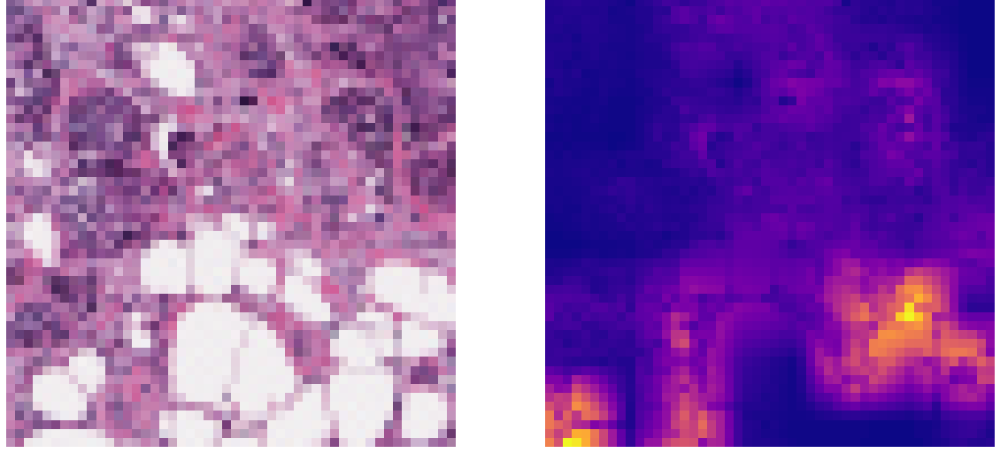

# Neural_Networks_Project 
The name of the project is the following: Augmenting Convolutional Networks with Attention-based Aggregation for Breast Cancer Detection.
This is the final project for the course of Neural Networks 2021/2022 held by professors Aurelio Uncini and Danilo Comminiello, at Sapienza University of Rome.
>Student: Filippo Betello Mat: `1835108`;
>
>Student: Federico Carmignani Mat: `1845479`;

## 📝 Assignment
1.	Reimplement the network architecture in the [Paper](https://arxiv.org/abs/2112.13692) for Image Classification on CIFAR10.
2.  Apply this innovative architecture to Breast Cancer Detection.

## 💾 Dataset
-   [CIFAR10](https://www.cs.toronto.edu/~kriz/cifar.html)
-   Kaggle Dataset for Breast Histopathology Images [Link 🔗](https://www.kaggle.com/datasets/paultimothymooney/breast-histopathology-images)

## 📜 Results
For CIFAR10 dataset results are very good:   
   
For the Kaggle dataset we obtained 87.95% of accuracy:   
   
This work can be found in the [PDF report](./Neural_network_project_BETELLO_CARMIGNANI.pdf) and in the [PPT] presentation(./PPT_NN.pptx).>br> 

We notice that in this last image we didn't know if the attention map created was highlighting the correct patch of the image, so we decide to use another [dataset](https://wiki.cancerimagingarchive.net/display/Public/CBIS-DDSM) where the ground trouth are provided:
   
This last step is currently under developing by professor Comminiello and one of his PhD students. [Here](link) you can find an abstract.

## 🙋 Info

for any doubt or clarification send an email at: carmignani.1845479@studenti.uniroma1.it or betello.1835108@studenti.uniroma1.it.
